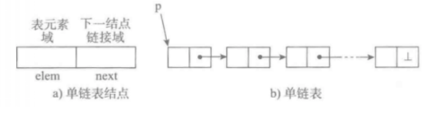

# Python 資料結構期中-單鏈表_11124141李佳穎

# 單鏈表概念
單鏈表由多個節點組成，每個節點包含：
- 數據域：儲存節點的值
- 指針域：指向下一個節點的引用

優點：插入與刪除效率高，不需移動其他元素/
缺點：查找元素需從頭節點依序遍歷

# 圖示

# 代碼作用
節點類別

單鏈表類別

is_empty() 判斷是否為空

length() 計算長度

travel() 遍歷輸出

add() 頭部插入

append() 尾部插入

insert() 指定位置插入

remove() 刪除節點

search() 查找節點

# 代碼
 class Node:
     """節點類"""
     def __init__(self, elem):
        self.elem = elem
        self.next = None

 class SingleLinkedList:
     """單鏈表"""
     def __init__(self):
        self._head = None

    def is_empty(self):
        """判斷是否為空"""
        return self._head is None

    def length(self):
        """獲取鏈表長度"""
        cur = self._head
        count = 0
        while cur is not None:
            count += 1
            cur = cur.next
        return count

    def travel(self):
        """遍歷鏈表"""
        cur = self._head
        elems = []
        while cur is not None:
            elems.append(cur.elem)
            cur = cur.next
        print(" -> ".join(str(e) for e in elems))

    def add(self, item):
        """頭部插入元素"""
        node = Node(item)
        node.next = self._head
        self._head = node

    def append(self, item):
        """尾部插入元素"""
        node = Node(item)
        if self.is_empty():
            self._head = node
        else:
            cur = self._head
            while cur.next is not None:
                cur = cur.next
            cur.next = node

    def insert(self, pos, item):
        """指定位置插入元素"""
        if pos <= 0:
            self.add(item)
        elif pos > (self.length() - 1):
            self.append(item)
        else:
            node = Node(item)
            count = 0
            pre = self._head
            while count < (pos - 1):
                count += 1
                pre = pre.next
            node.next = pre.next
            pre.next = node

    def remove(self, item):
        """刪除節點"""
        cur = self._head
        pre = None
        while cur is not None:
            if cur.elem == item:
                if pre is None:
                    self._head = cur.next
                else:
                    pre.next = cur.next
                return
            else:
                pre = cur
                cur = cur.next

    def search(self, item):
        """查找節點"""
        cur = self._head
        while cur is not None:
            if cur.elem == item:
                return True
            cur = cur.next
        return False

if __name__ == "__main__":
    ll = SingleLinkedList()
    print("鏈表是否為空:", ll.is_empty())
    print("鏈表長度:", ll.length())

    ll.append(1)
    ll.append(2)
    ll.add(0)
    ll.insert(2, 1.5)

    print("遍歷鏈表:")
    ll.travel()

    print("鏈表長度:", ll.length())
    print("是否存在元素 1.5:", ll.search(1.5))
    print("刪除元素 1.5")
    ll.remove(1.5)
    ll.travel()

# 執行結果

